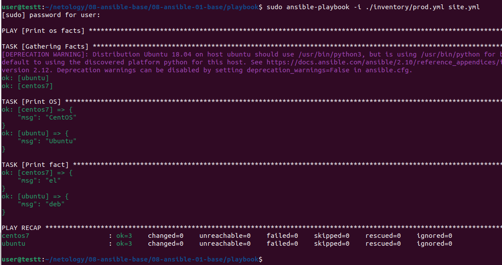
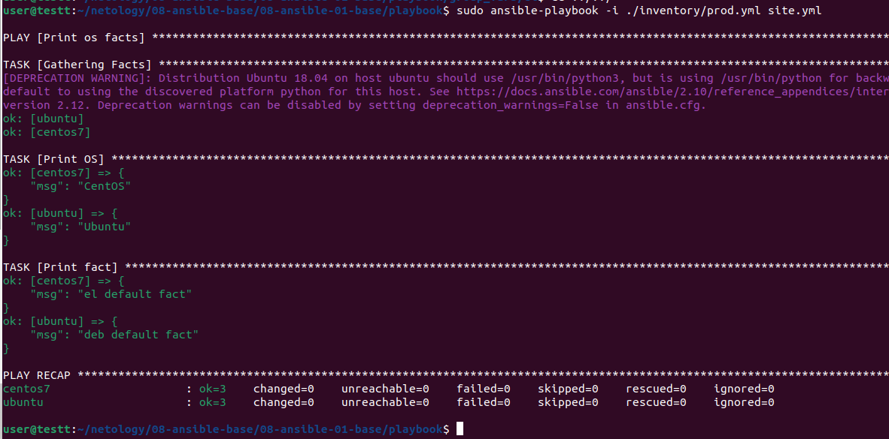
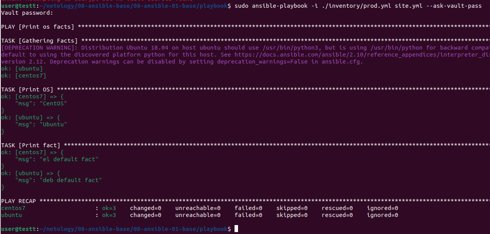
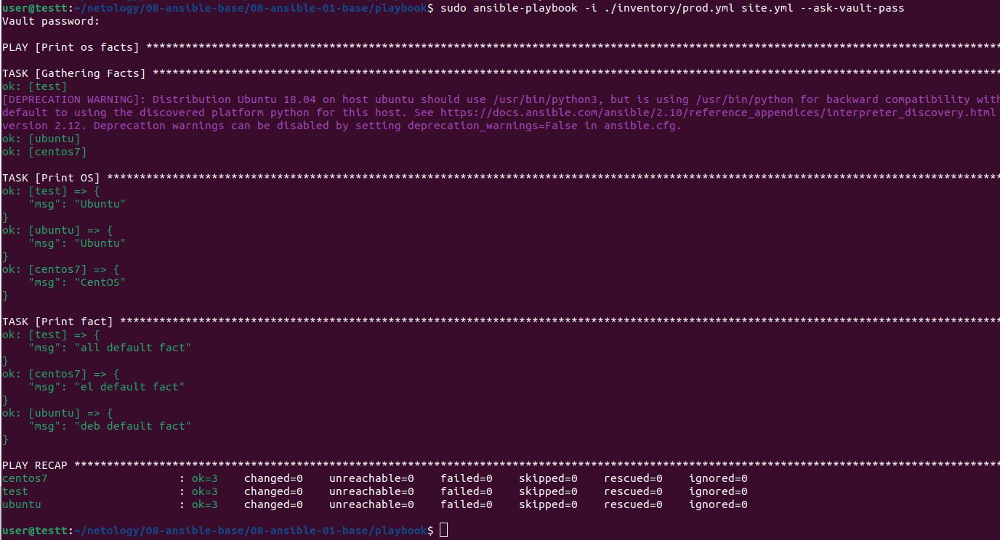

# 08-ansible-01-base

1. Запуск на окружении `test.yml`

`some_fact` = 12
2. Заменил в файле `group_vars/all/examp.yml` значение `12` на `all default fact`.
3. Запустил окружение для плейбука в контейнерах:
```
docker run -d --name ubuntu pycontribs/ubuntu sleep 100h
docker run -d --name centos7 pycontribs/centos:7 sleep 100h
```
4. Запуск на окружении `prod.yml`

5. Заменил значения в `group_vars/[deb,el]/examp.yml` для `deb — deb default fact`, для `el — el default fact`.
6. Повторный запуск на окружении `prod.yml`

7. Зашифровал файлы в `group_vars/[deb,el]` c помощью команды `ansible-vault encrypt group_vars/[deb,el]/examp.yml` с паролем netology.
8. Запуск на окружении `prod.yml` с флагом `--ask-vault-pass`

9. Посмотрел список плагинов с помощью команды `ansible-doc -t connection -l`, выбрал local.
10. Добавил в файл inventory/prod.yml группу хостов:
```
  local:
      hosts:
        test:
          ansible_connection: local
```  
11. Запуск на окружении `prod.yml`:

